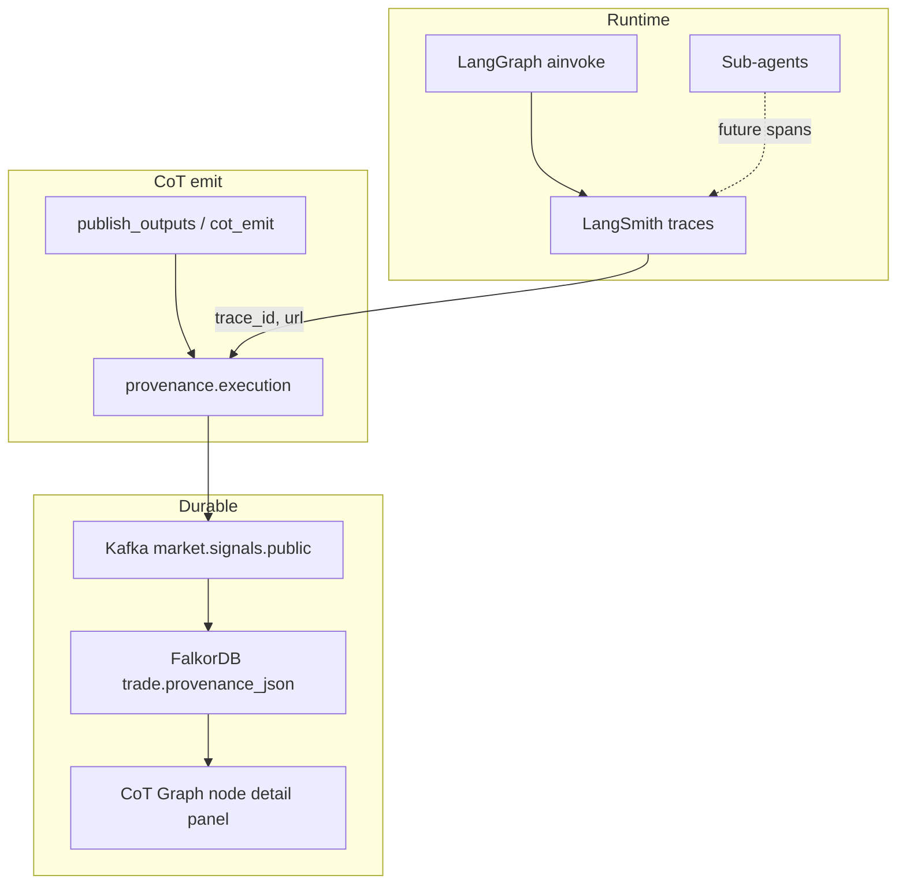
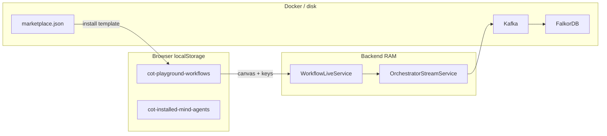

# Architecture — Sub-agents, Orchestrator, Tools, Workflows

This repo has four composable layers. Each layer is a **template** that the user wires
together on the React Flow canvas. **Edges define execution scope** — which tools and
sub-agents participate in a workflow — not runtime data piping between nodes.

```
                    ┌──────────────┐
            ┌──────►│  Sub-agent   │──── emits signal ────┐
            │       │  (News / Arb)│   (transparent)      │
   tool     │       └──────────────┘                      ▼
  snap  ────┤                                       ┌──────────────┐         ┌──────────┐
            │                                       │ Orchestrator │ ──────► │ CoT /    │
            │       ┌──────────────┐                │ (LangGraph)  │         │ Output   │
            └──────►│    Tool      │ ──── invoke ──►│              │         └──────────┘
                    │ (CoinGecko…) │                └──────┬───────┘
                    └──────────────┘                       │
                                                           └── invokes tools wired to LLM only
```

| Layer | Role | Visibility to orchestrator |
| --- | --- | --- |
| **Sub-agents** (hosted) | Stream signals from snapped tools + fixed `SYSTEM_PROMPT` + optional `userPrompt` | **Transparent** — orchestrator sees `subagent_registry` (tools, userPrompt, capabilities) |
| **Mind agents** (marketplace installs) | External or published workflows | **Black box** — only signals, CoT, and reasoning visible; strategy hidden |
| **Tools** | Stateless async API wrappers | Invoked by sub-agents (snapped) or orchestrator (wired to LLM) |
| **Orchestrator** | LangGraph that consumes signals and emits trade decisions | Sees registries compiled from canvas |

Whether a tool or sub-agent participates is determined entirely by **canvas edges**.

---

## 1. Sub-agents — transparent signal producers

Each hosted sub-agent is a **standalone template**: it fetches data via **snapped tools**
on the canvas (tool registry), runs a fixed `SYSTEM_PROMPT` in code, and accepts an
optional `userPrompt` on the node for strategy focus. It streams to Kafka and WebSocket.

| Sub-agent | Feed tools (wire on left) | LLM job | Polls |
| --- | --- | --- | --- |
| **News** (`newsAgent`) | `cryptonews`, `tavily` (snapped) | classify headline → sentiment, direction, strength, keywords, categories, thesis | default 30 s |
| **Arbitrage** (`arbitrageAgent`) | `polymarketGamma`, `kalshi` (snapped) | verify two markets resolve on the **same event** and write the per-opportunity thesis | default 15 s |

Both sub-agents **refuse to run** unless `llmProvider`, `llmApiKey`, and `model` are set
on the node. Validation lives in `_validate_llm_config` in each sub-agent file. The shared
LLM client is `backend/app/llm/client.py` (`complete_json`).

Common signal shape:

```jsonc
{
  "type": "news" | "arbitrage",
  "agent": "newsAgent" | "arbitrageAgent",
  "direction": "bullish" | "bearish" | "neutral",
  "strength": 0.0,
  "keywords": [],
  "thesis": "",
  "ts": "iso8601"
}
```

Registry: `backend/app/subagents/registry.py` exposes each sub-agent with
`streamSignals(config)` and `validateConfig(config)`. Tool fetching is centralized in
`backend/app/subagents/tool_loop.py`.

Sub-agent files:
- `backend/app/subagents/news_subagent.py`
- `backend/app/subagents/arbitrage_subagent.py`
- `backend/app/subagents/tool_loop.py` — registry-driven tool invocation
- `backend/app/subagents/cot_emit.py` — auto CoT emit when workflow is live
- `backend/app/subagents/registry.py`

---

## 2. Tools — stateless async endpoints

A tool is a single async function `f(params: dict) -> dict` returning
`{ ok, source, request, data, error }`.

Registered in `backend/app/orchestrator/tools_registry.py`:

```python
TOOL_HANDLERS = {
    "coingecko":        fetch_coingecko,
    "coinmarketcap":    fetch_coinmarketcap,
    "polymarketGamma":  fetch_gamma_markets,
    "polymarketWallet": fetch_polymarket_wallet,
    "cryptonews":       fetch_cryptonews,
    "tavily":           fetch_tavily,
    "cryptoquant":      fetch_cryptoquant,
    "defillama":        fetch_defillama,
    "clob":             _invoke_clob,
    "kalshi":           _invoke_kalshi,
}
```

`ToolRegistry.invoke_parallel(calls)` runs concurrently (cap `MAX_ENRICHMENT_CALLS = 6`).
Errors are per-tool `{ ok: false, error }` — they do not abort the run.

`backend/app/orchestrator/tool_specs.py` carries LLM-facing descriptions for orchestrator
planning. Sub-agents receive a `tool_registry` slice from `compile_workflow_context`.

---

## 3. Orchestrator — LangGraph router + LLM synthesizer

The orchestrator turns inbound signals into trade decisions. LangGraph topology in
`backend/app/orchestrator/graph.py`, nodes in `backend/app/orchestrator/nodes.py`:

```
ingest_signal → route_signal → … → llm_synthesize → publish_outputs
```

At ingest, `compile_workflow_context` populates state with:
- `subagent_registry` — transparent metadata for wired sub-agents
- `mind_agent_registry` — black-box feed sources (marketplace installs)
- `orchestrator_registry` — execution tools, visible tools, LLM config
- `workflow_topology` — `has_orchestrator`, `auto_emit_cot`, `publish_as_mind_agent`

`llm_synthesize` receives `subagent_registry_entry` for transparent sub-agents so the
orchestrator LLM can reason about feed context and user strategy focus without seeing
mind-agent internals.

**Skills registry** (`skills_registry.py`): exposes wired tools and sub-agent feed ids to
the orchestrator LLM. Snapped sub-agent tools are **not** duplicated as orchestrator skills
— sub-agents own their tool loop.

On each decision emit, orchestrator runs attach a LangSmith-aware
`provenance.execution` bundle (see [§8 LangSmith observability](#8-langsmith-observability--cot-provenance)).

---

## 4. Canvas wiring — compile to registries

`backend/app/orchestrator/workflow_context.py` (`compile_workflow_context`) turns nodes +
edges into runtime registries:

| Edge | Effect |
| --- | --- |
| `Tool ─► Sub-agent` | Tool added to sub-agent `execution_tools` + `tool_configs` |
| `Sub-agent ─► Orchestrator (llm)` | Sub-agent in `connected_subagents`; signals flow to orchestrator |
| `Tool ─► Orchestrator (llm)` | Tool in orchestrator `execution_tools` (planner can invoke) |
| `Sub-agent ─► cotBuilder` | Standalone path; `auto_emit_cot` when cotBuilder `autoEmit` is on |
| `Orchestrator (llm) ─► cotBuilder` | Decision path; CoT emitted when decision is not HOLD |
| `Orchestrator (llm) ─► workflowOutput` | Output inspector populated on **Run Workflow** only |
| `Tool ─► workflowOutput` | Tool result JSON/text to output node on Run Workflow |

Example:

```
[cryptonews] ──► [newsAgent] ──► [llm] ──► [cotBuilder]
[tavily]     ──►              ▲
[polymarketGamma] ────────────┘
```

Compiles to `subagent_registry.newsAgent.execution_tools = ["cryptonews", "tavily"]`,
`orchestrator_registry.execution_tools = ["polymarketGamma"]`, etc.

---

## 5. Workflow Go Live

**Primary control:** header **Go Live / Stop Live** in the playground (`Playground.tsx`).

1. Frontend POSTs `POST /api/orchestrator/start` with full canvas + optional config
   (`mind_agent_live`, `publishAsMindAgent` when cotBuilder has `autoEmit`).
2. `WorkflowLiveService` (`backend/app/services/workflow_live.py`) compiles context and
   starts **all wired sub-agents** via `AutonomousStreamService`, then the orchestrator
   if an LLM node exists.
3. `POST /api/orchestrator/stop` stops orchestrator and all started sub-agents.
4. `GET /api/orchestrator/workflow/status` reports live state.

Sub-agent nodes and marketplace cards show **Managed by workflow Go Live** when active;
per-agent Start buttons are hidden. **Run Workflow** (single shot) is disabled while live.

CoT auto-emit: when `cotBuilder.autoEmit` is on or `publish_as_mind_agent` is set,
`cot_emit.maybe_emit_cot_for_subagent` publishes decision JSON to Kafka after each signal.

**Publish** (`POST /api/marketplace/workflows`) saves a sanitized template only — it does not
start sub-agents or the orchestrator. Subscribers install the canvas, re-enter API keys, and
use **Go Live** on their own backend instance.

Monitor live orchestrator decisions: `GET /api/orchestrator/status` → `lastResult`,
`processed`, `recentSignals`; WebSocket event `orchestrator.result`.

---

## 6. Mind agents vs hosted sub-agents

| | Hosted sub-agent | Mind agent (marketplace) |
| --- | --- | --- |
| Strategy | Transparent (`userPrompt` + tools in registry) | Hidden |
| Start | Workflow Go Live (or legacy per-agent API) | Publisher runs workflow live |
| CoT | Optional via cotBuilder / publish flag | Auto when publisher goes live |
| Publish | N/A | `PublishWorkflowModal` → `publishAsMindAgent` |

Published workflows are stored in `data/workflows/marketplace.json` with secrets stripped.

---

## 7. Playground — drafts, secrets, Run vs Go Live, CoT Graph UI

### Workflow drafts (browser localStorage)

Playground canvases are **not** stored on the backend until **Publish**. Draft workflows
persist in the browser:

| Key | Content |
| --- | --- |
| `cot-playground-workflows` | Array of `{ id, name, createdAt, updatedAt, canvas: { nodes, edges } }` |
| `cot-playground-active-workflow-id` | Last selected workflow id |

Implementation: `frontend/lib/workflow-storage.ts`. The header **Workflow** bar supports
select, inline rename, **+ New**, and **Delete**. Autosave debounces canvas edits (~250 ms)
and **flushes on `pagehide`** (refresh / tab close). Boot logic loads from localStorage
before mounting `WorkflowCanvas` so an empty React Flow state cannot wipe a saved workflow.

**Publish** still strips `apiKey`, `llmApiKey`, `apiSecret`, and related fields from the
marketplace copy (`frontend/lib/workflow-marketplace.ts` + backend sanitize). Local drafts
retain secrets for local dev only.

Other browser stores: `cot-installed-mind-agents` (marketplace palette),
`cot-paper-trading-workspaces` (paper trade at `/simulate`), optional `cot-coindesk-api-key`.

### API keys — canvas first, `.env` fallback

| Secret | Primary (Go Live / Run) | Backend `.env` fallback |
| --- | --- | --- |
| LLM (`llmApiKey`) | Orchestrator + sub-agent nodes | `NEWS_LLM_API_KEY`, `ARB_LLM_API_KEY`, provider/model vars |
| Tool (`apiKey`) | Tool nodes on canvas | `CRYPTO_NEWS_API_KEY`, `TAVILY_API_KEY`, `COINGECKO_API_KEY`, … |
| LangSmith | N/A (backend only) | `LANGCHAIN_TRACING_V2`, `LANGCHAIN_API_KEY`, `LANGCHAIN_PROJECT` |
| External publisher | `kalshiSports/.env` | `COT_WRAPPER_API_KEY`, `COT_PUBLISHER_KEYS` |

Sub-agents **refuse Go Live** without LLM provider + key + model on the node (or valid
compiled config from canvas). Tool keys on snapped nodes are passed through
`compile_workflow_context` → `tool_configs` to backend streams.

See `backend/.env.example` and `run-setup.md` Part 0 for the full env table.

### Run Workflow vs Go Live

| | **Go Live** | **Run Workflow** (single shot) |
| --- | --- | --- |
| Trigger | Header **Go Live** | Header **Run Workflow** (disabled while live) |
| Sub-agents | Continuous asyncio loops | Uses latest feed signal only |
| Orchestrator | Background queue (`OrchestratorStreamService`) | `POST /api/orchestrator/run` |
| Tool preview nodes | Not continuous | Runnable tools execute once in graph order |
| Execution sinks (CLOB/Kalshi/Telegram) | Not continuous | Wired execution tools run after orchestrator |
| Output node (`workflowOutput`) | **Not updated** (no WS bridge yet) | Populated in node inspector via `workflow-runner.ts` |
| CoT → Kafka → FalkorDB | When auto-emit + non-`HOLD` | Same on single run |
| Backend state | In-memory until Stop / restart | Per-request |
| Verify live | `GET /api/orchestrator/status` (`lastResult`, `processed`) | Select LLM / Output / CoT Builder in inspector |

Output payload formatting: `formatOutputPayload()` in `frontend/lib/workflow-runner.ts` (JSON
or plain text).

### CoT Graph tab — live data vs sample fallback

The **CoT Graph** tab (`CotGraphView.tsx`) loads `GET /api/graphs/{graphId}/snapshot` via
`frontend/lib/cot-graph.ts`. Default graph id:
`NEXT_PUBLIC_MAIN_GRAPH_ID` → `user_771.main.v1` (must match `MAIN_GRAPH_ID` on CoT Builder
and orchestrator nodes).

When FalkorDB returns **no nodes** or the request fails, the UI falls back to
`SAMPLE_SNAPSHOT` (demo chain) and shows a sidebar hint. **Live graph:** no sample banner;
refresh by pressing **Enter** in the Graph ID field (no auto-poll yet).

Node click → `GET /api/graphs/{graphId}/nodes/{nodeId}` → **Decision analysis** +
**LangSmith observability** in the right rail (`CotGraphNodeDetail.tsx`). Trade-linked
market/outcome nodes inherit provenance from the linked trade.

### Playground canvas UI

| Component | Role |
| --- | --- |
| `Playground.tsx` | Workflow bar, Go Live / Run / Publish, CoT Graph toggle |
| `WorkflowCanvas.tsx` | React Flow editor, node inspector overlay, minimap |
| `NodeInspectorPanel.tsx` | Right rail over canvas; stops above minimap; ~80% transparent when empty |
| `PlaygroundMinimap.tsx` | Labeled “Canvas map”, semi-transparent map body, full-width pan/zoom |
| `LlmNode.tsx` | Orchestrator in-node description + 3-step flow list |
| `node-wiring.ts` / `graph-catalog.ts` | Handle semantics and palette wiring rules |

---

## 8. LangSmith observability + CoT provenance

Observability is **two linked layers** — LangSmith holds full execution traces; the CoT graph
holds a **summarized, queryable record** per decision. The decision graph topology
(`user → market → trade → outcome`) is unchanged; LangSmith data lives under
`provenance.execution` on each `DecisionEvent`.



| Layer | Stores | Purpose |
| --- | --- | --- |
| **LangSmith** | Full trace tree — prompts, tool I/O, spans, tokens, cost, errors | Debug, ops dashboard, replay |
| **CoT graph** | `provenance.execution` summary on trade nodes | Durable decision audit linked to graph topology |
| **CoT Graph UI** | Reads FalkorDB via `GET /api/graphs/{graphId}/nodes/{nodeId}` | Decision analysis + observability sidebar |

### How LangSmith wraps LangGraph

The orchestrator uses LangGraph (`backend/app/orchestrator/graph.py`). LangGraph is built on
LangChain Core and **auto-traces** when these env vars are set in `backend/.env`:

```bash
LANGCHAIN_TRACING_V2=true
LANGCHAIN_API_KEY=lsv2_pt_...
LANGCHAIN_PROJECT=cot-workflows
```

Each `run_orchestrator()` → `compiled.ainvoke()` produces a root run; each LangGraph node
(`ingest_signal`, `plan_tools`, `invoke_tools`, `llm_synthesize`, …) becomes a child span.
No manual “wrap” is required for the orchestrator path.

Sub-agents (`news_subagent`, `arbitrage_agent`) call `complete_json` via raw `httpx` today —
they do **not** yet appear under the same LangSmith tree unless separately instrumented with
`@traceable` or LangSmith run helpers. Orchestrator spans are the first integrated slice.

### Provenance shape (additive JSON)

Core `DecisionEvent` fields (`nodes[]`, `edges[]`, node types) are unchanged. Observability
is attached at emit time:

```jsonc
{
  "decision_id": "dec-trd_m001-open",
  "nodes": [ "/* unchanged topology */" ],
  "edges": [ "/* thesis on market → trade edge */" ],
  "provenance": {
    "raw_sources": ["https://polymarket.com/..."],
    "execution": {
      "schema_version": "1.0",
      "langsmith": {
        "project": "cot-workflows",
        "trace_id": "...",
        "run_id": "...",
        "url": "https://smith.langchain.com/..."
      },
      "workflow": { "workflow_id": "...", "path": "orchestrator" },
      "agents": [
        { "agent_id": "newsAgent", "role": "subagent", "contribution": "signal" },
        { "agent_id": "orchestrator", "role": "synthesizer", "contribution": "final_decision" }
      ],
      "tools": [{ "tool_id": "tavily", "ok": true, "latency_ms": 420 }],
      "llm_usage": {
        "total_input_tokens": 0,
        "total_output_tokens": 0,
        "total_cost_usd": 0.0,
        "calls": []
      },
      "steps": ["ingest_signal", "plan_tools", "invoke_tools", "llm_synthesize", "publish_outputs"],
      "finished_at": "2026-06-15T12:00:00Z"
    }
  }
}
```

When tracing is active, `build_execution_provenance` (`backend/app/observability/execution_provenance.py`)
calls `get_current_run_tree()` to capture `trace_id` / `run_id` at CoT emit time.

### Emit paths

| Path | Builder | `workflow.path` |
| --- | --- | --- |
| Orchestrator → cotBuilder | `publish_outputs` in `nodes.py` | `orchestrator` |
| Sub-agent → cotBuilder (direct) | `cot_emit.maybe_emit_cot_for_subagent` | `subagent_direct` |

Both call `build_cot_decision(..., provenance=merge_provenance(..., execution=...))` in
`backend/app/tools/cot_builder.py`.

### FalkorDB persistence + API

On merge (`backend/app/falkordb/cypher_delta.py`):

- **Trade nodes** — `decision_id`, `provenance_json` (full provenance blob)
- **OPEN_* edges** — `thesis`, `reasoning`, `conviction`, `tags`, `decision_id`

Node detail API: `GET /api/graphs/{graph_id}/nodes/{node_id}` (`backend/app/falkordb/service.py`)
returns `decision`, `observability` (the `execution` block), and linked edges. Outcome /
feedback / market nodes inherit observability from the linked trade node.

Frontend: **CoT Graph** view (`frontend/components/playground/CotGraphView.tsx`) shows
**Decision analysis** and **LangSmith observability** below **Node info** when a node is
selected (`frontend/components/playground/CotGraphNodeDetail.tsx`).

### Design rule

Do **not** store full LangSmith logs in FalkorDB — store summary + `langsmith.url` pointer.
LangSmith answers “show me every step”; the graph answers “what was decided, why, and what
did it cost to get there?”

---

## 9. State & persistence summary



| Data | Survives refresh? | Survives backend restart? |
| --- | --- | --- |
| Playground draft workflows | Yes (localStorage) | Yes |
| Go Live session | Yes (browser status poll) until backend dies | No — click Go Live again |
| CoT graph (FalkorDB) | Yes | Yes (Kafka replay + worker) |
| Published marketplace templates | Yes | Yes |
| LangSmith traces | N/A | Yes (LangSmith cloud) |

Operational guide: **`run-setup.md`** (Part 1 — real-time walkthrough).

---

## 10. File index

**Sub-agents** (`backend/app/subagents/`)
- `registry.py`, `news_subagent.py`, `arbitrage_subagent.py`
- `tool_loop.py`, `cot_emit.py`

**Orchestrator** (`backend/app/orchestrator/`)
- `workflow_context.py` — canvas → registries (primary compile)
- `compile.py` — re-export alias
- `graph.py`, `nodes.py`, `planner.py`, `llm_synthesize.py`
- `tools_registry.py`, `tool_specs.py`, `skills_registry.py`
- `graph_registry.py`, `state.py`, `runner.py`

**Services** (`backend/app/services/`)
- `workflow_live.py` — Go Live orchestration
- `workflow_marketplace.py` — publish/browse workflows
- `autonomous_stream.py` — sub-agent background streams
- `orchestrator_stream.py` — orchestrator background loop

**Observability** (`backend/app/observability/`)
- `execution_provenance.py` — `provenance.execution` builder + LangSmith run capture

**Frontend — playground**
- `frontend/components/playground/Playground.tsx` — workflow bar, Go Live / Stop Live, boot from storage
- `frontend/components/playground/WorkflowCanvas.tsx` — canvas, inspector overlay, minimap
- `frontend/components/playground/PlaygroundMinimap.tsx` — labeled minimap rail
- `frontend/components/playground/NodeInspectorPanel.tsx` — floating inspector (clears minimap)
- `frontend/components/playground/{PublishWorkflowModal,AgentMarketplace,CotGraphView,CotGraphNodeDetail}.tsx`
- `frontend/lib/workflow-storage.ts` — multi-workflow localStorage CRUD + autosave guards
- `frontend/lib/workflow-live.ts` — Go Live API client
- `frontend/lib/workflow-runner.ts` — single Run Workflow + output node population
- `frontend/lib/workflow-marketplace.ts` — publish/install (secrets stripped)
- `frontend/lib/cot-graph.ts` — graph snapshot + node detail API client + sample fallback
- `frontend/lib/dnd.ts` — node defaults including `userPrompt`, API key fields
- `frontend/lib/node-wiring.ts`, `frontend/lib/graph-catalog.ts` — wiring catalog
- `frontend/nodes/subagents/{NewsAgentNode,ArbitrageAgentNode,RiskAnalyzerNode}.tsx`
- `frontend/nodes/mindagents/LlmNode.tsx` — orchestrator node UI
- `frontend/nodes/tools/OutputNode.tsx` — workflow output sink

**Docs**
- `run-setup.md` — local real-time setup, env keys, Go Live verification, CoT graph checks
- `backend/.env.example` — infrastructure, graph IDs, LLM/tool fallbacks, LangSmith vars
