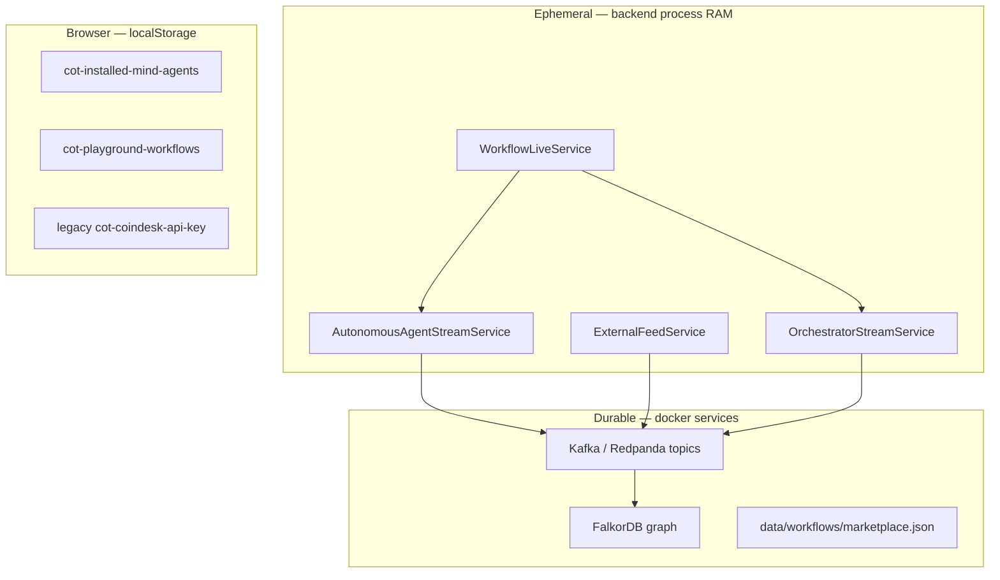

# Full platform run guide

End-to-end instructions for running the playground **in real time**: infrastructure, saved workflows, wiring sub-agents → orchestrator → CoT graph, Go Live, verifying decisions, and optional LangSmith traces.

**Start here after one-time setup:** [Real-time walkthrough](#real-time-walkthrough--orchestrator-tools--live-cot-graph) (Part 1).

---

## Architecture overview

Three roles in a typical demo:

```text
Publisher (your machine)          Platform (docker + backend + frontend)       Subscriber (playground)
─────────────────────────         ──────────────────────────────────────       ─────────────────────
kalshiSports + HTTP wrapper  ──►  Backend :4000  ──►  Kafka / FalkorDB         Install feed + build canvas
                                  Playground :3001 ◄── WebSocket feeds          Go Live → LLM → CoT
```

| Role | What you run | What others see |
|------|----------------|-----------------|
| **External publisher** | `kalshiSports` + wrapper on your machine | Feed in marketplace; Live when signals arrive |
| **Workflow operator** | Playground **Go Live** | Hosted sub-agents + orchestrator run 24/7 in backend |
| **Subscriber** | Install mind agents + load published workflows | Signals, decisions, CoT graph |

### Agent types in the marketplace

| Type | Badge | Who runs 24/7 | How to start |
|------|-------|---------------|--------------|
| **Hosted sub-agent** (newsAgent, arbitrageAgent) | Hosted | FastAPI backend (asyncio tasks) | **Go Live** on canvas (primary) or legacy per-agent Start in marketplace |
| **External mind agent** (kalshiSports) | External | Publisher's machine | Publisher runs `python main.py`; platform ingests HTTP only |
| **Published workflow** | Workflow / Mind agent | Backend when subscriber clicks **Go Live** | Load canvas → configure keys → **Go Live** |
| **Published as mind agent** | Workflow + Mind agent | Same as Go Live | Strategy hidden; signals + CoT visible to subscribers |

---

## State management — how everything is tracked today

**Important:** Live agent and workflow state is **in-memory inside the FastAPI process**. It is **not** persisted to Redis or a database. If the backend restarts, all live sessions stop and must be restarted via **Go Live** (or legacy Start buttons).

### State layers



| Store | Location | What it holds | Survives restart? |
|-------|----------|---------------|-------------------|
| **Workflow live** | `WorkflowLiveService` (`backend/app/services/workflow_live.py`) | `_running`, `_workflow_context` (compiled registries), `_started_subagents[]` | No |
| **Hosted sub-agent session** | `AutonomousAgentStreamService._sessions` | `running`, `emittedCount`, `lastSignal`, `lastError`, asyncio `Task` per agent | No |
| **Orchestrator stream** | `OrchestratorStreamService` | `_canvas`, `_config`, `_memory.recent_signals`, `_queue`, `_processed`, `_last_result` | No |
| **External mind agent** | `ExternalFeedService._sessions` | `lastSeen`, `lastSignal`, `emittedCount` — **live** = signal within `staleAfterSeconds` (45s) | No (lastSeen lost) |
| **LangGraph run** | `OrchestratorState` per invocation | Signal, registries, tool results, decision — rebuilt each `run_once` | N/A (per-run) |
| **Kafka topics** | Redpanda | `agent.feeds.*.public`, `market.signals.public` | Yes |
| **CoT graph** | FalkorDB | Merged decision nodes/edges | Yes |
| **Published workflows** | `data/workflows/marketplace.json` | Sanitized canvas templates | Yes |
| **Playground drafts** | `localStorage` key `cot-playground-workflows` | Named workflows + canvas + node API keys (local only) | Yes (browser only) |
| **Installed agents (UI)** | `localStorage` key `cot-installed-mind-agents` | Which marketplace nodes appear on palette | Yes (browser only) |

### Hosted sub-agent lifecycle (newsAgent / arbitrageAgent)

1. **Go Live** → `POST /api/orchestrator/start` with full canvas.
2. `compile_workflow_context()` builds `subagent_registry` (snapped tools, `userPrompt`, LLM config, `tool_registry` slice).
3. `WorkflowLiveService` calls `AutonomousAgentStreamService.start(agent_id, config)` for each wired sub-agent.
4. Backend spawns `asyncio.create_task(_run_loop)` → `streamSignals(config)` async generator.
5. Each signal:
   - Updates in-memory session (`lastSignal`, `emittedCount`)
   - Publishes to Kafka `agent.feeds.<agentId>.public`
   - Broadcasts WebSocket `agent.feed`
   - Enqueues orchestrator if orchestrator stream is running
   - Optionally auto-emits CoT via `cot_emit.maybe_emit_cot_for_subagent` when `autoEmit` or `publish_as_mind_agent`

**Stop Live** → cancels tasks, clears sessions, stops orchestrator loop.

### Sub-agent → mind agent (published workflow)

When you publish with **Publish as mind agent** or Go Live with `cotBuilder.autoEmit`:

- Topology flag `publish_as_mind_agent` is set in compiled `workflow_context`.
- Sub-agents remain **transparent** to the publisher (you see tools + userPrompt on canvas).
- Subscribers who install the published workflow see **signals + CoT only** — strategy (tools, prompts) is not exposed in the marketplace listing.
- Runtime is still **your backend** hosting the asyncio loops — not a separate microservice per agent yet.

### External mind agent lifecycle (kalshiSports)

- Publisher runs `kalshiSports/main.py` on **their** machine (localhost, VPS, or later AWS EC2/ECS).
- `cot_wrapper.py` POSTs to `POST /api/feeds/sportsScanner.user_demo/signal`.
- Platform `ExternalFeedService` records `lastSeen` and publishes to Kafka.
- **Live** = `lastSeen` within 45 seconds — no Start button on platform; publisher process IS the host.
- Orchestrator (when Go Live) consumes enqueued signals same as hosted feeds.

### Orchestrator memory

- **Single-shot Run Workflow:** `POST /api/orchestrator/run` — uses `OrchestratorStreamService._memory` if present.
- **Go Live:** `OrchestratorStreamService._loop` dequeues signals, runs LangGraph, updates `_memory.recent_signals` for corroboration across ticks.
- Memory is **per backend process**, not per user/session (single-tenant demo today).

### Frontend live state

- `fetchWorkflowLiveStatus()` polls `GET /api/orchestrator/workflow/status` every 8s on sub-agent nodes.
- `AgentFeedProvider` holds `agentFeeds` + WebSocket push for latest signals.
- When `workflowLive === true`, sub-agent nodes and marketplace hide individual Start buttons.

---

## Hosting model — localhost today, AWS later

### Today (local dev)

| Component | Where it runs | 24/7? |
|-----------|---------------|-------|
| FastAPI backend | `npm run dev:backend` — one Python process | Only while terminal is open |
| Hosted sub-agents | asyncio tasks **inside** that same process | Same as backend |
| Orchestrator stream | asyncio task **inside** backend | Same as backend |
| External publisher | Separate terminal (`kalshiSports`) | While that terminal runs |
| Kafka, FalkorDB | `docker compose up -d` | Yes (containers) |
| Next.js frontend | `npm run dev:frontend` | While terminal runs |

**There is no separate container per mind agent today.** All hosted agents share one FastAPI worker.

### Target AWS layout (recommended path)

```text
┌─────────────────────────────────────────────────────────────────┐
│  Route 53 / ALB                                                  │
│    ├── ECS Fargate: cot-backend (FastAPI, N replicas)           │
│    ├── ECS Fargate or Amplify: cot-frontend (Next.js)           │
│    ├── Amazon MSK (or self-managed Kafka) ← agent feeds + CoT     │
│    ├── FalkorDB on EC2/ElastiCache-compatible or managed graph  │
│    └── S3: data/workflows/marketplace.json (+ secrets Manager)  │
└─────────────────────────────────────────────────────────────────┘
         ▲                                    ▲
         │ HTTP wrapper                       │ optional
   Publisher ECS/EC2                    External agents (any cloud)
   (kalshiSports, custom strategies)
```

| Concern | Local now | AWS later |
|---------|-----------|-----------|
| Workflow Go Live state | RAM in one process | Same pattern per ECS task; need **sticky sessions** or **single leader** until state is externalized |
| 24/7 hosted agents | Keep backend terminal open | ECS service `desired_count >= 1`, health checks on `/api/health` |
| External publishers | localhost:kalshiSports | Publisher's ECS task / Lambda+scheduled / on-prem |
| Secrets (LLM keys, tool keys) | Node canvas + `.env` | AWS Secrets Manager; never on published canvas |
| Durable signals | Kafka | MSK with retention policy |
| CoT graph | FalkorDB container | FalkorDB cluster or Neo4j Aura per product choice |

**Gap to close before multi-instance AWS:** persist `WorkflowLiveService` + session state in Redis or DynamoDB, or run exactly one backend replica for live workflows.

---

## Part 0 — One-time setup

### 1. Install dependencies

```powershell
cd C:\Users\Anjali\Downloads\CoT_kb

npm install
npm run install:backend

cd kalshiSports
pip install -r requirements.txt
cd ..
```

### 2. Start infrastructure

```powershell
docker compose up -d
```

Wait ~1 minute for containers to become healthy.

| Service | URL | Purpose |
|---------|-----|---------|
| **Playground** | http://localhost:3001 | Workflow canvas + marketplace |
| **Backend API** | http://localhost:4000 | Orchestrator, feeds, CoT ingest |
| **FalkorDB Browser** | http://localhost:3000 | Graph GUI |
| **Redpanda Console** | http://localhost:8080 | Kafka topics and messages |
| **Neo4j Browser** | http://localhost:7474 | Optional legacy (`neo4j` / `cot-kb-password`) |
| **RedisInsight** | http://localhost:8001 | Optional Redis visualization |

### 3. Environment files

**Backend** — copy and edit:

```powershell
copy backend\.env.example backend\.env
```

Minimum for this guide:

```env
PORT=4000
KAFKA_BROKERS=localhost:19092
FALKORDB_HOST=localhost
FALKORDB_PORT=6380

# CoT graph namespace — must match CoT Builder + Orchestrator nodes + frontend
MAIN_GRAPH_ID=user_771.main.v1
MAIN_USER_NODE_ID=user_771
COT_KAFKA_FROM_BEGINNING=1

# LLM fallbacks (optional if keys are set on canvas nodes — recommended on nodes for Go Live)
NEWS_LLM_API_KEY=your_gemini_or_openai_key_here
NEWS_LLM_PROVIDER=gemini
NEWS_LLM_MODEL=gemini-2.0-flash

# Tool fallbacks (optional if keys are set on cryptonews/tavily tool nodes)
CRYPTO_NEWS_API_KEY=
TAVILY_API_KEY=

# External wrapper auth (must match kalshiSports)
COT_WRAPPER_API_KEY=cot-dev-wrapper-key

# LangSmith — optional; attaches trace URLs to CoT provenance
LANGCHAIN_TRACING_V2=true
LANGCHAIN_API_KEY=lsv2_pt_your_key_here
LANGCHAIN_PROJECT=cot-workflows
```

**Where API keys are required for real-time runs:**

| Key | Required? | Where to set |
|-----|-----------|--------------|
| **LLM** (Gemini/OpenAI/Claude) | **Yes** — sub-agents refuse to start without | **Canvas:** News/Arbitrage/Orchestrator node `llmApiKey` (preferred). Optional fallback: `NEWS_LLM_API_KEY` / `ARB_LLM_API_KEY` in `backend/.env` |
| **cryptonews / tavily** | **Yes** for News Agent demo | **Canvas:** tool node `apiKey`. Optional fallback: `CRYPTO_NEWS_API_KEY`, `TAVILY_API_KEY` in `backend/.env` |
| **LangSmith** | Optional | `backend/.env` only — `LANGCHAIN_*` |
| **Kalshi / Polymarket / etc.** | Per workflow | Canvas tool nodes + venue credentials on execution nodes |
| **External publisher** | For sports feed only | `COT_WRAPPER_API_KEY` in backend + `kalshiSports/.env` |

**Frontend** — copy and edit:

```powershell
copy frontend\.env.example frontend\.env.local
```

Minimum:

```env
NEXT_PUBLIC_API_URL=http://localhost:4000
NEXT_PUBLIC_WS_URL=ws://localhost:4000/ws
NEXT_PUBLIC_MAIN_GRAPH_ID=user_771.main.v1
NEXT_PUBLIC_MAIN_USER_ID=user_771
```

**kalshiSports wrapper:**

```powershell
cd kalshiSports
copy .env.example .env
```

Edit `kalshiSports/.env`:

```env
COT_WRAPPER_ENABLED=1
COT_API_URL=http://localhost:4000
COT_AGENT_ID=sportsScanner.user_demo
COT_PUBLISHER_KEY=cot-dev-wrapper-key
```

For live Kalshi mode (not `--simulate`), also set `API_FOOTBALL_KEY` from [api-football.com](https://www.api-football.com/).

---

## Part 1 — Real-time walkthrough: orchestrator, tools, and live CoT graph

Use this section to run everything connected and verify orchestrator output plus the **live** FalkorDB graph (not the sample fallback).

### Prerequisites

```text
□ docker compose up -d          (Kafka + FalkorDB healthy)
□ backend/.env + frontend/.env.local configured (graph IDs aligned)
□ npm run dev:backend           Terminal A
□ npm run dev:frontend          Terminal B → http://localhost:3001
```

Confirm backend health:

```powershell
curl http://localhost:4000/api/health
```

Expect `"kafka": true` and `"falkordb": true`.

### Step 1 — Save a named workflow (browser persistence)

1. Open the playground header **Workflow** bar.
2. Use **+ New** to create workflows; rename inline (autosaves to `localStorage`).
3. Select a workflow from the dropdown — canvas restores after refresh.

API keys on tool/LLM nodes are saved with the workflow locally. **Publish** still strips secrets from marketplace copies.

### Step 2 — Install agents and build the canvas

**Marketplace** → Install **News Agent** (minimum for a self-contained demo).

Recommended wiring (hosted sub-agent → orchestrator → CoT → output):

```text
[cryptonews] ──► [newsAgent] ──► [llm / Orchestrator] ──► [cotBuilder]
[tavily]     ──►              │                        └──► [workflowOutput]
                              ▲
                    (optional: polymarketGamma for extra orchestrator tools)
```

| Node | Required settings |
|------|-------------------|
| **cryptonews** | `apiKey` — [CryptoNews API](https://cryptonews-api.com/) or backend `CRYPTO_NEWS_API_KEY` |
| **tavily** | `apiKey` — [Tavily](https://tavily.com/) or backend `TAVILY_API_KEY` |
| **News Agent** | LLM provider + **API key** + model (required — sub-agent refuses to start without these) |
| **Orchestrator (llm)** | Same LLM settings; **Graph ID** = `user_771.main.v1`; **User node ID** = `user_771` |
| **CoT Builder** | Same graph/user IDs; **Auto emit** = ON (publishes to Kafka → FalkorDB) |
| **Output** (optional) | Wire from orchestrator **right output** — see Step 6 for when it populates |

**Graph ID alignment (critical for live graph):**

| Place | Value |
|-------|-------|
| `backend/.env` → `MAIN_GRAPH_ID` | `user_771.main.v1` |
| `frontend/.env.local` → `NEXT_PUBLIC_MAIN_GRAPH_ID` | `user_771.main.v1` |
| Orchestrator node → Graph ID | `user_771.main.v1` |
| CoT Builder node → Graph ID | `user_771.main.v1` |

If these differ, decisions emit to one namespace but the CoT Graph tab reads another — you will see the **sample** chain instead of live data.

### Step 3 — Go Live (continuous real-time loop)

1. Confirm all API keys on wired nodes.
2. Click **Go Live** in the header.

Backend sequence:

1. `POST /api/orchestrator/start` with your canvas.
2. `compile_workflow_context()` — tools snapped to sub-agents, orchestrator registry built from edges.
3. **News Agent** asyncio loop polls cryptonews/tavily every ~30s.
4. Each signal → Kafka `agent.feeds.newsAgent.public` + WebSocket `agent.feed`.
5. If orchestrator is wired → signal enqueued → LangGraph run → decision JSON.
6. If **Auto emit** on CoT Builder → non-`HOLD` decisions → Kafka `market.signals.public` → FalkorDB worker merges into `user_771.main.v1`.

**Stop Live** before single **Run Workflow** (button is disabled while live).

### Step 4 — Verify sub-agent signals (feeds are live)

| Where | What to look for |
|-------|------------------|
| **Playground** → select **News Agent** node → inspector | Latest signal JSON, feed count, “Managed by workflow Go Live” |
| **Redpanda Console** http://localhost:8080 | Topic `agent.feeds.newsAgent.public` — new messages every poll |
| **WebSocket** | Browser devtools → WS `ws://localhost:4000/ws` — `agent.feed` events |

If no signals: check tool API keys, backend logs, or `GET /api/orchestrator/workflow/status` → `started_subagents`.

### Step 5 — Verify orchestrator decisions (real time)

While **Go Live** is active, the orchestrator runs in the background on each enqueued signal.

**Option A — Backend status API (best for Go Live):**

```powershell
curl http://localhost:4000/api/orchestrator/status
```

Check:

- `"running": true`
- `"processed"` incrementing over time
- `"lastResult"` — latest LangGraph output (`decision`, `steps`, `cot`)
- `"recentSignals"` — last feed previews

**Option B — WebSocket:**

Listen for `orchestrator.result` events on `/ws` (decision + steps summary).

**Option C — Single-shot with full UI (Run Workflow):**

1. **Stop Live**
2. Wait for at least one sub-agent signal (or run external publisher — Part 3)
3. Click **Run Workflow**
4. Select **Orchestrator (llm)** node → inspector shows `workflowResult` JSON (full orchestrator output)
5. Select **CoT Builder** → `cotOutput` DecisionEvent JSON when action ≠ `HOLD`

**Note:** Output nodes (`workflowOutput`) populate on **Run Workflow** only today — not continuously during Go Live. Use orchestrator status API or LLM inspector for live monitoring.

### Step 6 — Verify the live CoT graph (not hardcoded sample)

1. Ensure **Auto emit** is ON and orchestrator produced a non-`HOLD` decision (or sub-agent → cotBuilder direct path with auto-emit).
2. **Redpanda Console** → topic `market.signals.public` — CoT delta messages.
3. Playground → **CoT Graph** tab.
4. Graph ID field = `user_771.main.v1` → press **Enter** to reload snapshot.

**Live graph indicators:**

- Sidebar does **not** say “showing sample CoT chain”
- New `trade`, `market`, `outcome` nodes appear after emits
- Click a **trade** node → sidebar shows **Decision analysis** + **LangSmith observability** (when tracing env is set)

**FalkorDB Browser** http://localhost:3000 — graph name derived from `user_771.main.v1` (e.g. `user_771_main_v1`).

**If you still see sample data:** FalkorDB empty, Kafka worker down, graph ID mismatch, or only `HOLD` decisions (nothing emitted). Fix IDs, confirm `/api/health`, trigger a bullish/bearish news signal with strength ≥ 0.55.

### Step 7 — Optional: LangSmith traces

With backend env:

```env
LANGCHAIN_TRACING_V2=true
LANGCHAIN_API_KEY=lsv2_pt_...
LANGCHAIN_PROJECT=cot-workflows
```

Restart backend. After an orchestrator run:

1. CoT Graph → click a **trade** node → **LangSmith observability** panel → **Open trace** link
2. Or open https://smith.langchain.com → project `cot-workflows`

Token/cost totals in the graph are summarized; full prompts/spans live in LangSmith. Sub-agent LLM calls may appear as separate traces until fully nested.

### Step 8 — Publish vs Go Live (what changes)

| Action | Runs tools/market live? | Updates CoT graph? | Persists canvas? |
|--------|-------------------------|--------------------|------------------|
| **Go Live** | Yes — hosted sub-agents + orchestrator loop | Yes — when auto-emit + non-HOLD | No (in-memory backend; browser draft in localStorage) |
| **Publish** | No — template only | No | Yes — `data/workflows/marketplace.json` (keys stripped) |
| **Run Workflow** | Once — tools + orchestrator + execution sinks | Only if CoT Builder wired and not HOLD | N/A |

Publishing after Go Live does **not** stop live execution. Installing a published workflow loads the template; subscriber must re-enter API keys and click **Go Live** on their backend.

### Real-time checklist

```text
□ Graph IDs aligned (backend, frontend, llm node, cotBuilder)
□ Tool + LLM API keys on canvas nodes
□ Auto emit ON on CoT Builder
□ Go Live → workflow/status shows started sub-agents
□ Redpanda: agent.feeds.* + market.signals.public receiving messages
□ GET /api/orchestrator/status → processed > 0, lastResult populated
□ CoT Graph tab → user_771.main.v1 → live nodes (no sample banner)
□ Optional: LangSmith trace link on trade node
```

---

## Part 2 — Start the platform

Use **three terminals** for the full demo.

**Terminal A — backend**

```powershell
cd C:\Users\Anjali\Downloads\CoT_kb
npm run dev:backend
```

Verify: http://localhost:4000/api/health → `"ok": true`, Kafka and FalkorDB available.

**Terminal B — frontend**

```powershell
cd C:\Users\Anjali\Downloads\CoT_kb
npm run dev:frontend
```

Open **http://localhost:3001**.

**Terminal C — kalshiSports publisher** (see Part 3)

---

## Part 3 — Run kalshiSports autonomously (external publisher)

kalshiSports is an **external** mind agent: you run the process; the platform only ingests HTTP signals.

```powershell
cd C:\Users\Anjali\Downloads\CoT_kb\kalshiSports

python main.py --simulate
python main.py --simulate --max-trades 3
python main.py   # live — needs API_FOOTBALL_KEY
```

The wrapper POSTs to:

```http
POST http://localhost:4000/api/feeds/sportsScanner.user_demo/signal
Authorization: Bearer cot-dev-wrapper-key
```

**Verify in Redpanda Console:** topic `agent.feeds.sportsScanner.user_demo.public`

Keep `python main.py` running — that is the publisher's 24/7 process.

---

## Part 4 — Marketplace: install mind agents

1. Click **Marketplace** in the header.
2. Install **Kalshi Sports Scanner**, **News Agent**, and/or **Arbitrage Agent** as needed.
3. External agents show **Live** when the publisher process is sending signals (~45s window).

**Note:** Per-agent **Start live feed** in the marketplace is legacy. Prefer **Go Live** on the workflow canvas (Part 1 / Part 6).

---

## Part 5 — Build a workflow canvas

### News + orchestrator (hosted sub-agent)

Wire tools on the **left** of the News Agent node:

```text
[cryptonews] ──► [newsAgent] ──► [llm] ──► [cotBuilder]
[tavily]     ──►              ▲
```

| Node | Configuration |
|------|----------------|
| **cryptonews / tavily** | API keys on tool nodes |
| **News Agent** | LLM provider + API key + model; optional **User prompt** |
| **Orchestrator (llm)** | Provider, system/user prompts, graph ID `user_771.main.v1` |
| **CoT Builder** | Graph ID, user node ID; enable **Auto emit** for Kafka → FalkorDB |

### Arbitrage scanner

```text
[polymarketGamma] ──► [arbitrageAgent] ──► [llm] ──► [cotBuilder]
[kalshi]          ──►
```

Arbitrage requires LLM on the node for same-event verification.

### External sports feed subscriber

```text
[sportsScanner] ──► [llm] ──► [cotBuilder]
```

Install Kalshi Sports Scanner from marketplace; run kalshiSports publisher (Part 3).

### Output node (inspect orchestrator / tool results)

```text
[llm] ──► [workflowOutput]
[tool] ──► [workflowOutput]   (when tool is upstream in run order)
```

Wire the **right output handle** of the orchestrator or tool into the Output node. After **Run Workflow** (Stop Live first), select the Output node → inspector shows `outputPayload` as formatted JSON/text regardless of upstream shape.

During **Go Live**, use `GET /api/orchestrator/status` or the Orchestrator node inspector after a manual **Run Workflow** — output nodes are not WS-patched yet.

### Sub-agent only → CoT (no orchestrator)

```text
[newsAgent] ──► [cotBuilder]     with cotBuilder autoEmit ON
```

Go Live starts the sub-agent only; CoT auto-emits per signal.

---

## Part 6 — Go Live (primary 24/7 control)

1. Configure all API keys on tool and LLM nodes.
2. Click **Go Live** in the playground header.

What happens:

1. `POST /api/orchestrator/start` with canvas JSON.
2. `compile_workflow_context()` builds registries (`subagent_registry`, `orchestrator_registry`, `topology`).
3. Each wired sub-agent starts an asyncio poll loop in the backend.
4. If an LLM node exists, `OrchestratorStreamService` starts and consumes enqueued signals.
5. If `cotBuilder.autoEmit` is on, Go Live also sets `mind_agent_live` / `publish_as_mind_agent` for CoT auto-emit.

**Stop Live** → `POST /api/orchestrator/stop` — stops orchestrator and all started sub-agents.

Status API:

```http
GET /api/orchestrator/workflow/status
```

Returns `running`, `started_subagents`, `topology`, per-subagent status.

**Run Workflow** (single shot) is disabled while live — use Stop Live first.

---

## Part 7 — Run Workflow once (debug / single decision)

1. Ensure a feed has emitted at least one signal (Go Live running, or external publisher active).
2. Click **Run Workflow**.

Phases:

1. Runnable tool nodes on canvas (preview).
2. `POST /api/orchestrator/run` — LangGraph with latest signal from installed feeds.
3. Results on **Orchestrator (llm)**, **CoT Builder**, and **Output** nodes (select node → right inspector).

If you see demo Bitcoin news, no live feed has arrived yet — use Go Live or start a publisher first.

---

## Part 8 — View the CoT graph (live vs sample)

### In-playground (live data)

1. **CoT Graph** tab → Graph ID `user_771.main.v1` (must match `MAIN_GRAPH_ID` and CoT Builder node).
2. Press **Enter** in the Graph ID field after each emit to reload — there is no auto-poll yet.
3. If sidebar says **“showing sample CoT chain”**, FalkorDB is empty or IDs mismatch — see Part 1 Step 6.
4. Click nodes → **Decision analysis** + **LangSmith observability** in the right rail.

### FalkorDB Browser

- http://localhost:3000 — `redis://falkordb-server:6379`

### Redpanda Console

- `market.signals.public` — CoT deltas after emit
- `agent.feeds.*.public` — raw agent signals

---

## Part 9 — Publish a workflow

1. Build canvas → **Publish**.
2. Fill name, description, optional publisher handle.
3. Check **Publish as mind agent** to hide strategy from subscribers (signals + CoT only).
4. API keys stripped automatically → `data/workflows/marketplace.json`.
5. Marketplace → **Workflow** badge (and **Mind agent** if checked) → **Load onto canvas**.

Subscribers configure their own keys and use **Go Live** to run 24/7 on their backend.

---

## Part 10 — Adding a new agent

### External wrapper (kalshiSports pattern)

1. Emit via `POST /api/feeds/{agent_id}/signal` + publisher API key.
2. Register in `backend/app/external_agents/registry.py`.
3. Add frontend node + marketplace entry.
4. Publisher runs their process 24/7 on their infrastructure.

Reference: `kalshiSports/cot_wrapper.py`.

### Hosted sub-agent (newsAgent / arbitrageAgent pattern)

1. Implement `streamSignals()` + `validateConfig()` in `backend/app/subagents/`.
2. Register in `backend/app/subagents/registry.py` and `backend/app/signal_registry.py`.
3. Add frontend node with tool snap handles + `userPrompt`.
4. Wire tools on canvas; start via **Go Live**.

Reference: `backend/app/subagents/news_subagent.py`, `backend/app/services/autonomous_stream.py`.

### Published workflow as product

1. Build canvas → Publish (optionally as mind agent).
2. Subscribers load template → Go Live on their platform instance.

---

## API reference (live operations)

| Endpoint | Purpose |
|----------|---------|
| `GET /api/health` | Kafka + FalkorDB readiness |
| `GET /api/graphs/{graph_id}/snapshot` | Live CoT graph for playground tab |
| `GET /api/graphs/{graph_id}/nodes/{node_id}` | Decision + LangSmith summary for selected node |
| `POST /api/orchestrator/start` | Go Live — canvas + optional `config` |
| `POST /api/orchestrator/stop` | Stop Live |
| `GET /api/orchestrator/workflow/status` | Workflow + sub-agent live state |
| `GET /api/orchestrator/status` | Orchestrator stream — `lastResult`, `processed`, `recentSignals` |
| `POST /api/orchestrator/run` | Single LangGraph run |
| `POST /api/marketplace/agents/{id}/start` | Legacy per-agent start |
| `POST /api/marketplace/agents/{id}/stop` | Legacy per-agent stop |
| `GET /api/marketplace/agents/{id}/status` | Per-agent session status |
| `POST /api/feeds/{agent_id}/signal` | External publisher ingest |
| `POST /api/marketplace/workflows` | Publish canvas template |

---

## Quick checklist

Follow **Part 1** for the full real-time path. Short form:

```text
□ docker compose up -d
□ backend\.env — MAIN_GRAPH_ID, LLM/tool fallbacks, optional LANGCHAIN_* keys
□ frontend\.env.local — NEXT_PUBLIC_MAIN_GRAPH_ID matches backend
□ npm run dev:backend + npm run dev:frontend
□ Playground: name/save workflow (localStorage autosave)
□ Marketplace → Install News Agent (or others)
□ Canvas: tools → sub-agents → LLM → CoT Builder (+ Output optional)
□ Graph IDs + Auto emit ON + all API keys on nodes
□ Go Live
□ curl /api/orchestrator/status — processed > 0
□ Redpanda: agent.feeds.* + market.signals.public
□ CoT Graph → user_771.main.v1 → Enter to refresh (no sample banner)
□ Optional: LangSmith trace on trade node
□ Optional: Publish workflow (keys stripped)
```

---

## Troubleshooting

| Problem | Fix |
|---------|-----|
| Go Live fails "requires cryptonews or tavily" | Wire at least one feed tool to News Agent |
| Go Live fails LLM validation | Set provider + API key + model on sub-agent node |
| Live stops after backend restart | Expected — in-memory state; click Go Live again |
| External agent Offline | Publisher not running or wrapper disabled |
| `401 Invalid publisher API key` | Keys mismatch between kalshiSports and backend `.env` |
| Run Workflow uses demo signal | No live feed yet — Go Live or start publisher |
| CoT Graph shows **sample** chain | Empty FalkorDB, graph ID mismatch, or only HOLD decisions — see Part 1 Step 6 |
| CoT Graph not updating live | Press Enter in Graph ID field to reload; confirm `market.signals.public` in Redpanda |
| Orchestrator `processed` stays 0 | Sub-agent not wired to LLM, or no signals — check feed topics |
| Output node empty during Go Live | Expected — use Run Workflow or `GET /api/orchestrator/status` |
| LangSmith panel empty | Set `LANGCHAIN_TRACING_V2` + `LANGCHAIN_API_KEY`; restart backend |
| Kafka errors in `/api/health` | `docker compose up -d`, wait for redpanda healthy |
| Publish fails | Backend running; canvas needs ≥1 node |
| Workflow lost on refresh | Should autosave — check browser localStorage not blocked |

---

## Related files

| Path | Role |
|------|------|
| `backend/app/services/workflow_live.py` | Go Live coordinator |
| `backend/app/services/autonomous_stream.py` | Hosted sub-agent tasks + Kafka + WS |
| `backend/app/services/orchestrator_stream.py` | Orchestrator queue + memory |
| `backend/app/services/external_feed.py` | External publisher ingest + live detection |
| `backend/app/orchestrator/workflow_context.py` | Canvas → registries compile |
| `backend/app/subagents/cot_emit.py` | Auto CoT from sub-agent signals |
| `backend/app/signal_registry.py` | Marketplace catalog |
| `backend/app/external_agents/registry.py` | External agent definitions |
| `backend/app/services/workflow_marketplace.py` | Published workflow storage |
| `data/workflows/marketplace.json` | Published templates |
| `frontend/lib/workflow-live.ts` | Go Live client |
| `frontend/lib/agent-feed.tsx` | WebSocket + agent status |
| `frontend/lib/marketplace.tsx` | Installed agents (localStorage) |
| `frontend/lib/workflow-storage.ts` | Playground workflow drafts (localStorage) |
| `frontend/lib/workflow-runner.ts` | Run Workflow + output node population |
| `frontend/lib/cot-graph.ts` | CoT Graph API client + sample fallback |
| `frontend/components/playground/CotGraphView.tsx` | Live graph UI |
| `backend/app/observability/execution_provenance.py` | LangSmith + provenance bundle |
| `backend/app/kafka/worker.py` | MainWorker — Kafka → FalkorDB |
| `kalshiSports/cot_wrapper.py` | External publisher reference |
| `ARCHITECTURE.md` | Design reference (LangSmith §8) |
