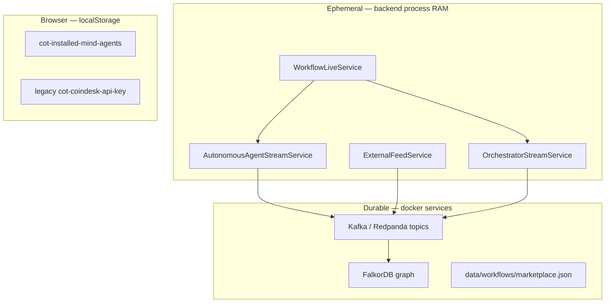

# Full platform run guide

End-to-end instructions for the CoT_kb playground: infrastructure, workflow Go Live, hosted sub-agents, external mind agents, marketplace publishing, orchestrator, and CoT graph.

---

## Architecture overview

Three roles in a typical demo:

```text
Publisher (your machine)          Platform (docker + backend + frontend)       Subscriber (playground)
─────────────────────────         ──────────────────────────────────────       ─────────────────────
kalshiSports + HTTP wrapper  ──►  Backend :4000  ──►  Kafka / FalkorDB         Install feed + build canvas
                                  Playground :3001 ◄── WebSocket feeds          Go Live → LLM → CoT
```

| Role | What you run | What others see |
|------|----------------|-----------------|
| **External publisher** | `kalshiSports` + wrapper on your machine | Feed in marketplace; Live when signals arrive |
| **Workflow operator** | Playground **Go Live** | Hosted sub-agents + orchestrator run 24/7 in backend |
| **Subscriber** | Install mind agents + load published workflows | Signals, decisions, CoT graph |

### Agent types in the marketplace

| Type | Badge | Who runs 24/7 | How to start |
|------|-------|---------------|--------------|
| **Hosted sub-agent** (newsAgent, arbitrageAgent) | Hosted | FastAPI backend (asyncio tasks) | **Go Live** on canvas (primary) or legacy per-agent Start in marketplace |
| **External mind agent** (kalshiSports) | External | Publisher's machine | Publisher runs `python main.py`; platform ingests HTTP only |
| **Published workflow** | Workflow / Mind agent | Backend when subscriber clicks **Go Live** | Load canvas → configure keys → **Go Live** |
| **Published as mind agent** | Workflow + Mind agent | Same as Go Live | Strategy hidden; signals + CoT visible to subscribers |

---

## State management — how everything is tracked today

**Important:** Live agent and workflow state is **in-memory inside the FastAPI process**. It is **not** persisted to Redis or a database. If the backend restarts, all live sessions stop and must be restarted via **Go Live** (or legacy Start buttons).

### State layers



| Store | Location | What it holds | Survives restart? |
|-------|----------|---------------|-------------------|
| **Workflow live** | `WorkflowLiveService` (`backend/app/services/workflow_live.py`) | `_running`, `_workflow_context` (compiled registries), `_started_subagents[]` | No |
| **Hosted sub-agent session** | `AutonomousAgentStreamService._sessions` | `running`, `emittedCount`, `lastSignal`, `lastError`, asyncio `Task` per agent | No |
| **Orchestrator stream** | `OrchestratorStreamService` | `_canvas`, `_config`, `_memory.recent_signals`, `_queue`, `_processed`, `_last_result` | No |
| **External mind agent** | `ExternalFeedService._sessions` | `lastSeen`, `lastSignal`, `emittedCount` — **live** = signal within `staleAfterSeconds` (45s) | No (lastSeen lost) |
| **LangGraph run** | `OrchestratorState` per invocation | Signal, registries, tool results, decision — rebuilt each `run_once` | N/A (per-run) |
| **Kafka topics** | Redpanda | `agent.feeds.*.public`, `market.signals.public` | Yes |
| **CoT graph** | FalkorDB | Merged decision nodes/edges | Yes |
| **Published workflows** | `data/workflows/marketplace.json` | Sanitized canvas templates | Yes |
| **Installed agents (UI)** | `localStorage` key `cot-installed-mind-agents` | Which marketplace nodes appear on palette | Yes (browser only) |
| **Canvas wiring** | React Flow in browser | Nodes, edges, API keys on nodes — **not auto-saved** unless you publish | Until page refresh |

### Hosted sub-agent lifecycle (newsAgent / arbitrageAgent)

1. **Go Live** → `POST /api/orchestrator/start` with full canvas.
2. `compile_workflow_context()` builds `subagent_registry` (snapped tools, `userPrompt`, LLM config, `tool_registry` slice).
3. `WorkflowLiveService` calls `AutonomousAgentStreamService.start(agent_id, config)` for each wired sub-agent.
4. Backend spawns `asyncio.create_task(_run_loop)` → `streamSignals(config)` async generator.
5. Each signal:
   - Updates in-memory session (`lastSignal`, `emittedCount`)
   - Publishes to Kafka `agent.feeds.<agentId>.public`
   - Broadcasts WebSocket `agent.feed`
   - Enqueues orchestrator if orchestrator stream is running
   - Optionally auto-emits CoT via `cot_emit.maybe_emit_cot_for_subagent` when `autoEmit` or `publish_as_mind_agent`

**Stop Live** → cancels tasks, clears sessions, stops orchestrator loop.

### Sub-agent → mind agent (published workflow)

When you publish with **Publish as mind agent** or Go Live with `cotBuilder.autoEmit`:

- Topology flag `publish_as_mind_agent` is set in compiled `workflow_context`.
- Sub-agents remain **transparent** to the publisher (you see tools + userPrompt on canvas).
- Subscribers who install the published workflow see **signals + CoT only** — strategy (tools, prompts) is not exposed in the marketplace listing.
- Runtime is still **your backend** hosting the asyncio loops — not a separate microservice per agent yet.

### External mind agent lifecycle (kalshiSports)

- Publisher runs `kalshiSports/main.py` on **their** machine (localhost, VPS, or later AWS EC2/ECS).
- `cot_wrapper.py` POSTs to `POST /api/feeds/sportsScanner.user_demo/signal`.
- Platform `ExternalFeedService` records `lastSeen` and publishes to Kafka.
- **Live** = `lastSeen` within 45 seconds — no Start button on platform; publisher process IS the host.
- Orchestrator (when Go Live) consumes enqueued signals same as hosted feeds.

### Orchestrator memory

- **Single-shot Run Workflow:** `POST /api/orchestrator/run` — uses `OrchestratorStreamService._memory` if present.
- **Go Live:** `OrchestratorStreamService._loop` dequeues signals, runs LangGraph, updates `_memory.recent_signals` for corroboration across ticks.
- Memory is **per backend process**, not per user/session (single-tenant demo today).

### Frontend live state

- `fetchWorkflowLiveStatus()` polls `GET /api/orchestrator/workflow/status` every 8s on sub-agent nodes.
- `AgentFeedProvider` holds `agentFeeds` + WebSocket push for latest signals.
- When `workflowLive === true`, sub-agent nodes and marketplace hide individual Start buttons.

---

## Hosting model — localhost today, AWS later

### Today (local dev)

| Component | Where it runs | 24/7? |
|-----------|---------------|-------|
| FastAPI backend | `npm run dev:backend` — one Python process | Only while terminal is open |
| Hosted sub-agents | asyncio tasks **inside** that same process | Same as backend |
| Orchestrator stream | asyncio task **inside** backend | Same as backend |
| External publisher | Separate terminal (`kalshiSports`) | While that terminal runs |
| Kafka, FalkorDB | `docker compose up -d` | Yes (containers) |
| Next.js frontend | `npm run dev:frontend` | While terminal runs |

**There is no separate container per mind agent today.** All hosted agents share one FastAPI worker.

### Target AWS layout (recommended path)

```text
┌─────────────────────────────────────────────────────────────────┐
│  Route 53 / ALB                                                  │
│    ├── ECS Fargate: cot-backend (FastAPI, N replicas)           │
│    ├── ECS Fargate or Amplify: cot-frontend (Next.js)           │
│    ├── Amazon MSK (or self-managed Kafka) ← agent feeds + CoT     │
│    ├── FalkorDB on EC2/ElastiCache-compatible or managed graph  │
│    └── S3: data/workflows/marketplace.json (+ secrets Manager)  │
└─────────────────────────────────────────────────────────────────┘
         ▲                                    ▲
         │ HTTP wrapper                       │ optional
   Publisher ECS/EC2                    External agents (any cloud)
   (kalshiSports, custom strategies)
```

| Concern | Local now | AWS later |
|---------|-----------|-----------|
| Workflow Go Live state | RAM in one process | Same pattern per ECS task; need **sticky sessions** or **single leader** until state is externalized |
| 24/7 hosted agents | Keep backend terminal open | ECS service `desired_count >= 1`, health checks on `/api/health` |
| External publishers | localhost:kalshiSports | Publisher's ECS task / Lambda+scheduled / on-prem |
| Secrets (LLM keys, tool keys) | Node canvas + `.env` | AWS Secrets Manager; never on published canvas |
| Durable signals | Kafka | MSK with retention policy |
| CoT graph | FalkorDB container | FalkorDB cluster or Neo4j Aura per product choice |

**Gap to close before multi-instance AWS:** persist `WorkflowLiveService` + session state in Redis or DynamoDB, or run exactly one backend replica for live workflows.

---

## Part 0 — One-time setup

### 1. Install dependencies

```powershell
cd C:\Users\Anjali\Downloads\CoT_kb

npm install
npm run install:backend

cd kalshiSports
pip install -r requirements.txt
cd ..
```

### 2. Start infrastructure

```powershell
docker compose up -d
```

Wait ~1 minute for containers to become healthy.

| Service | URL | Purpose |
|---------|-----|---------|
| **Playground** | http://localhost:3001 | Workflow canvas + marketplace |
| **Backend API** | http://localhost:4000 | Orchestrator, feeds, CoT ingest |
| **FalkorDB Browser** | http://localhost:3000 | Graph GUI |
| **Redpanda Console** | http://localhost:8080 | Kafka topics and messages |
| **Neo4j Browser** | http://localhost:7474 | Optional legacy (`neo4j` / `cot-kb-password`) |
| **RedisInsight** | http://localhost:8001 | Optional Redis visualization |

### 3. Environment files

**Backend** — copy and edit:

```powershell
copy backend\.env.example backend\.env
```

Minimum for this guide:

```env
PORT=4000
KAFKA_BROKERS=localhost:19092
FALKORDB_HOST=localhost
FALKORDB_PORT=6380

# LLM orchestrator + sub-agents
GEMINI_API_KEY=your_key_here
GEMINI_MODEL=gemini-2.5-flash-lite

# CoT graph namespace (CoT Graph tab + CoT Builder default)
MAIN_GRAPH_ID=user_771.main.v1
MAIN_USER_NODE_ID=user_771

# External wrapper auth (must match kalshiSports)
COT_WRAPPER_API_KEY=cot-dev-wrapper-key
```

**Frontend:**

```powershell
copy frontend\.env.example frontend\.env.local
```

**kalshiSports wrapper:**

```powershell
cd kalshiSports
copy .env.example .env
```

Edit `kalshiSports/.env`:

```env
COT_WRAPPER_ENABLED=1
COT_API_URL=http://localhost:4000
COT_AGENT_ID=sportsScanner.user_demo
COT_PUBLISHER_KEY=cot-dev-wrapper-key
```

For live Kalshi mode (not `--simulate`), also set `API_FOOTBALL_KEY` from [api-football.com](https://www.api-football.com/).

---

## Part 1 — Start the platform

Use **three terminals** for the full demo.

**Terminal A — backend**

```powershell
cd C:\Users\Anjali\Downloads\CoT_kb
npm run dev:backend
```

Verify: http://localhost:4000/api/health → `"ok": true`, Kafka and FalkorDB available.

**Terminal B — frontend**

```powershell
cd C:\Users\Anjali\Downloads\CoT_kb
npm run dev:frontend
```

Open **http://localhost:3001**.

**Terminal C — kalshiSports publisher** (see Part 2)

---

## Part 2 — Run kalshiSports autonomously (external publisher)

kalshiSports is an **external** mind agent: you run the process; the platform only ingests HTTP signals.

```powershell
cd C:\Users\Anjali\Downloads\CoT_kb\kalshiSports

python main.py --simulate
python main.py --simulate --max-trades 3
python main.py   # live — needs API_FOOTBALL_KEY
```

The wrapper POSTs to:

```http
POST http://localhost:4000/api/feeds/sportsScanner.user_demo/signal
Authorization: Bearer cot-dev-wrapper-key
```

**Verify in Redpanda Console:** topic `agent.feeds.sportsScanner.user_demo.public`

Keep `python main.py` running — that is the publisher's 24/7 process.

---

## Part 3 — Marketplace: install mind agents

1. Click **Marketplace** in the header.
2. Install **Kalshi Sports Scanner**, **News Agent**, and/or **Arbitrage Agent** as needed.
3. External agents show **Live** when the publisher process is sending signals (~45s window).

**Note:** Per-agent **Start live feed** in the marketplace is legacy. Prefer **Go Live** on the workflow canvas (Part 5).

---

## Part 4 — Build a workflow canvas

### News + orchestrator (hosted sub-agent)

Wire tools on the **left** of the News Agent node:

```text
[cryptonews] ──► [newsAgent] ──► [llm] ──► [cotBuilder]
[tavily]     ──►              ▲
```

| Node | Configuration |
|------|----------------|
| **cryptonews / tavily** | API keys on tool nodes |
| **News Agent** | LLM provider + API key + model; optional **User prompt** |
| **Orchestrator (llm)** | Provider, system/user prompts, graph ID `user_771.main.v1` |
| **CoT Builder** | Graph ID, user node ID; enable **Auto emit** for Kafka → FalkorDB |

### Arbitrage scanner

```text
[polymarketGamma] ──► [arbitrageAgent] ──► [llm] ──► [cotBuilder]
[kalshi]          ──►
```

Arbitrage requires LLM on the node for same-event verification.

### External sports feed subscriber

```text
[sportsScanner] ──► [llm] ──► [cotBuilder]
```

Install Kalshi Sports Scanner from marketplace; run kalshiSports publisher (Part 2).

### Sub-agent only → CoT (no orchestrator)

```text
[newsAgent] ──► [cotBuilder]     with cotBuilder autoEmit ON
```

Go Live starts the sub-agent only; CoT auto-emits per signal.

---

## Part 5 — Go Live (primary 24/7 control)

1. Configure all API keys on tool and LLM nodes.
2. Click **Go Live** in the playground header.

What happens:

1. `POST /api/orchestrator/start` with canvas JSON.
2. `compile_workflow_context()` builds registries (`subagent_registry`, `orchestrator_registry`, `topology`).
3. Each wired sub-agent starts an asyncio poll loop in the backend.
4. If an LLM node exists, `OrchestratorStreamService` starts and consumes enqueued signals.
5. If `cotBuilder.autoEmit` is on, Go Live also sets `mind_agent_live` / `publish_as_mind_agent` for CoT auto-emit.

**Stop Live** → `POST /api/orchestrator/stop` — stops orchestrator and all started sub-agents.

Status API:

```http
GET /api/orchestrator/workflow/status
```

Returns `running`, `started_subagents`, `topology`, per-subagent status.

**Run Workflow** (single shot) is disabled while live — use Stop Live first.

---

## Part 6 — Run Workflow once (debug / single decision)

1. Ensure a feed has emitted at least one signal (Go Live running, or external publisher active).
2. Click **Run Workflow**.

Phases:

1. Runnable tool nodes on canvas (preview).
2. `POST /api/orchestrator/run` — LangGraph with latest signal from installed feeds.
3. Results on LLM Analyzer and CoT Builder nodes.

If you see demo Bitcoin news, no live feed has arrived yet.

---

## Part 7 — View the CoT graph

### In-playground

1. **CoT Graph** tab → Graph ID `user_771.main.v1`.
2. Inspect `user → protocol → market → trade` chains.

### FalkorDB Browser

- http://localhost:3000 — `redis://falkordb-server:6379`

### Redpanda Console

- `market.signals.public` — CoT deltas after emit
- `agent.feeds.*.public` — raw agent signals

---

## Part 8 — Publish a workflow

1. Build canvas → **Publish**.
2. Fill name, description, optional publisher handle.
3. Check **Publish as mind agent** to hide strategy from subscribers (signals + CoT only).
4. API keys stripped automatically → `data/workflows/marketplace.json`.
5. Marketplace → **Workflow** badge (and **Mind agent** if checked) → **Load onto canvas**.

Subscribers configure their own keys and use **Go Live** to run 24/7 on their backend.

---

## Part 9 — Adding a new agent

### External wrapper (kalshiSports pattern)

1. Emit via `POST /api/feeds/{agent_id}/signal` + publisher API key.
2. Register in `backend/app/external_agents/registry.py`.
3. Add frontend node + marketplace entry.
4. Publisher runs their process 24/7 on their infrastructure.

Reference: `kalshiSports/cot_wrapper.py`.

### Hosted sub-agent (newsAgent / arbitrageAgent pattern)

1. Implement `streamSignals()` + `validateConfig()` in `backend/app/subagents/`.
2. Register in `backend/app/subagents/registry.py` and `backend/app/signal_registry.py`.
3. Add frontend node with tool snap handles + `userPrompt`.
4. Wire tools on canvas; start via **Go Live**.

Reference: `backend/app/subagents/news_subagent.py`, `backend/app/services/autonomous_stream.py`.

### Published workflow as product

1. Build canvas → Publish (optionally as mind agent).
2. Subscribers load template → Go Live on their platform instance.

---

## API reference (live operations)

| Endpoint | Purpose |
|----------|---------|
| `POST /api/orchestrator/start` | Go Live — canvas + optional `config` |
| `POST /api/orchestrator/stop` | Stop Live |
| `GET /api/orchestrator/workflow/status` | Workflow + sub-agent live state |
| `GET /api/orchestrator/status` | Orchestrator stream only |
| `POST /api/orchestrator/run` | Single LangGraph run |
| `POST /api/marketplace/agents/{id}/start` | Legacy per-agent start |
| `POST /api/marketplace/agents/{id}/stop` | Legacy per-agent stop |
| `GET /api/marketplace/agents/{id}/status` | Per-agent session status |
| `POST /api/feeds/{agent_id}/signal` | External publisher ingest |
| `POST /api/marketplace/workflows` | Publish canvas template |

---

## Quick checklist

```text
□ docker compose up -d
□ backend\.env — GEMINI_API_KEY, COT_WRAPPER_API_KEY, graph IDs
□ frontend\.env.local
□ kalshiSports\.env — wrapper keys match backend
□ npm run dev:backend + npm run dev:frontend
□ Optional: python main.py --simulate (external publisher)
□ Marketplace → Install agents
□ Canvas: snap tools → sub-agents → LLM → CoT Builder
□ Tool + LLM API keys on nodes
□ Go Live
□ CoT Graph → user_771.main.v1
□ Optional: Publish workflow (mind agent checkbox)
```

---

## Troubleshooting

| Problem | Fix |
|---------|-----|
| Go Live fails "requires cryptonews or tavily" | Wire at least one feed tool to News Agent |
| Go Live fails LLM validation | Set provider + API key + model on sub-agent node |
| Live stops after backend restart | Expected — in-memory state; click Go Live again |
| External agent Offline | Publisher not running or wrapper disabled |
| `401 Invalid publisher API key` | Keys mismatch between kalshiSports and backend `.env` |
| Run Workflow uses demo signal | No live feed yet — Go Live or start publisher |
| CoT Graph empty | HOLD decision or auto-emit off — use non-HOLD + auto-emit |
| Kafka errors in `/api/health` | `docker compose up -d`, wait for redpanda healthy |
| Publish fails | Backend running; canvas needs ≥1 node |

---

## Related files

| Path | Role |
|------|------|
| `backend/app/services/workflow_live.py` | Go Live coordinator |
| `backend/app/services/autonomous_stream.py` | Hosted sub-agent tasks + Kafka + WS |
| `backend/app/services/orchestrator_stream.py` | Orchestrator queue + memory |
| `backend/app/services/external_feed.py` | External publisher ingest + live detection |
| `backend/app/orchestrator/workflow_context.py` | Canvas → registries compile |
| `backend/app/subagents/cot_emit.py` | Auto CoT from sub-agent signals |
| `backend/app/signal_registry.py` | Marketplace catalog |
| `backend/app/external_agents/registry.py` | External agent definitions |
| `backend/app/services/workflow_marketplace.py` | Published workflow storage |
| `data/workflows/marketplace.json` | Published templates |
| `frontend/lib/workflow-live.ts` | Go Live client |
| `frontend/lib/agent-feed.tsx` | WebSocket + agent status |
| `frontend/lib/marketplace.tsx` | Installed agents (localStorage) |
| `kalshiSports/cot_wrapper.py` | External publisher reference |
| `ARCHITECTURE.md` | Design reference |
